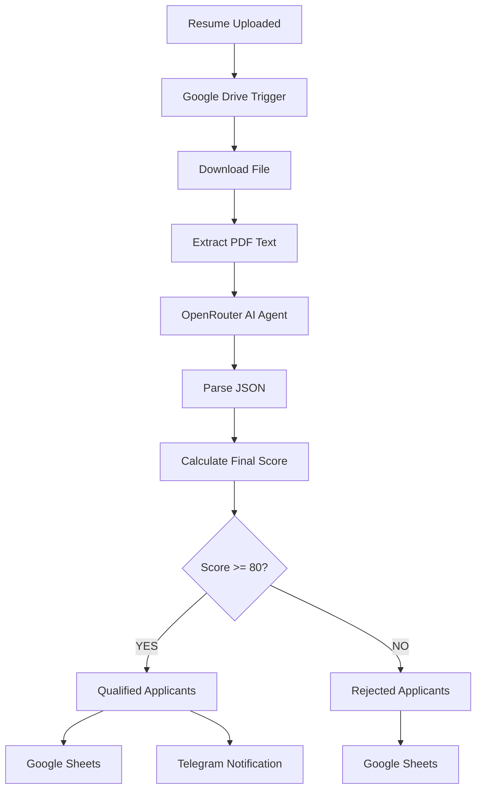

# 📄 AI Resume Screening & Ranking System v2 — n8n Automation


An AI-powered recruitment automation workflow built using **n8n**, **OpenRouter AI**, **Google Drive**, **Google Sheets**, **Telegram Bot API**, and **JavaScript**.

This workflow automatically monitors uploaded resumes, extracts text from PDF files, analyzes candidates using AI, calculates weighted hiring scores, classifies applicants into qualified or rejected categories, stores evaluation results in Google Sheets, and instantly notifies recruiters through Telegram.

---

# 🎯 Project Overview

## Problem

Recruiters often receive dozens or even hundreds of resumes for a single job posting. Manually reviewing each application is repetitive, time-consuming, and prone to inconsistent evaluations.

Some common recruitment challenges include:

* Reviewing resumes manually
* Extracting candidate information
* Comparing applicants fairly
* Ranking candidates consistently
* Maintaining an organized applicant database
* Notifying recruiters quickly

Traditional screening consumes valuable HR resources before interviews even begin.

---

# 💡 Solution

This project automates the first stage of recruitment using artificial intelligence.

The workflow automatically:

1. Detects newly uploaded resumes from Google Drive.
2. Downloads the PDF file.
3. Extracts resume text.
4. Sends the resume to an AI model through OpenRouter.
5. Extracts structured candidate information.
6. Calculates weighted evaluation scores.
7. Determines hiring recommendations.
8. Automatically separates qualified and rejected applicants.
9. Stores candidate records in Google Sheets.
10. Sends Telegram notifications for qualified candidates.

The result is an intelligent recruitment assistant capable of reducing manual resume screening time while improving evaluation consistency.

---

# ✨ Features

## Resume Processing

* ✅ Automatic Google Drive monitoring
* ✅ Resume upload detection
* ✅ PDF text extraction
* ✅ Contact information extraction
* ✅ Education detection
* ✅ Skills identification
* ✅ Certification detection
* ✅ Project detection

---

## Artificial Intelligence

* ✅ AI Resume Analysis
* ✅ Technical Skills Evaluation
* ✅ Experience Assessment
* ✅ Education Assessment
* ✅ Certification Assessment
* ✅ Job Match Analysis
* ✅ Interview Question Generation
* ✅ Strength & Weakness Identification

---

## Candidate Evaluation

* ✅ Technical Score
* ✅ Experience Score
* ✅ Education Score
* ✅ Project Score
* ✅ Certification Score
* ✅ Final Weighted Score
* ✅ Hiring Recommendation

---

## Automation

* ✅ Google Sheets Integration
* ✅ Telegram Notifications
* ✅ Automatic Candidate Classification
* ✅ Conditional Workflow Routing
* ✅ Structured JSON Parsing
* ✅ JavaScript Data Processing

---

# 🗺️ System Architecture



---

# 🏗 Workflow Implementation

## Node 1 — Google Drive Trigger

### Purpose

Monitors a Google Drive folder for newly uploaded resumes.

Whenever HR uploads a PDF resume, the workflow automatically starts.

Captured Information

* File Name
* File ID
* Upload Time
* Owner
* Google Drive Metadata

---

## Node 2 — Download File

### Purpose

Downloads the uploaded resume from Google Drive.

Input

```
Resume PDF
```

Output

```
Binary File
```

---

## Node 3 — Extract From PDF

### Purpose

Extracts readable text from the uploaded PDF.

The extracted content includes:

* Candidate Name
* Email
* Phone
* Education
* Skills
* Certifications
* Experience
* Projects

Output Example

```
John Michael Reyes

Bachelor of Science in Information Technology

Skills:
React
Node.js
Docker
Git
REST API
```

---

## Node 4 — AI Agent (OpenRouter)

### Purpose

Analyze the extracted resume against a predefined job description.

The AI evaluates:

* Technical Skills
* Education
* Experience
* Certifications
* Projects
* Job Match
* Strengths
* Weaknesses
* Interview Questions

The AI returns structured JSON.

Example

```json
{
  "candidate_name":"John Michael Reyes",
  "technical_score":95,
  "experience_score":85,
  "education_score":80,
  "project_score":90,
  "certification_score":80,
  "job_match_score":92,
  "recommendation":"Hire"
}
```

---

## Node 5 — Parse JSON (JavaScript)

### Purpose

The AI returns a JSON string.

This node:

* Parses JSON
* Fixes missing values
* Extracts candidate name
* Extracts email
* Extracts phone
* Extracts education
* Creates default arrays
* Prevents workflow failures

---

## Node 6 — Calculate Final Score

### Purpose

Calculates the weighted hiring score.

Formula

```
Final Score

=

Technical × 40%

+

Experience × 25%

+

Projects × 15%

+

Education × 10%

+

Certification × 10%
```

Recommendation Rules

| Score    | Recommendation |
| -------- | -------------- |
| 90–100   | Strong Hire    |
| 80–89    | Hire           |
| 70–79    | Maybe          |
| Below 70 | Reject         |

---

## Node 7 — IF Node

### Purpose

Automatically classify candidates.

Condition

```
Final Score >= 80
```

TRUE

Qualified Applicant

FALSE

Rejected Applicant

---

## Node 8 — Qualified Applicants Sheet

Stores successful applicants.

Columns

* Timestamp
* Candidate Name
* Email
* Phone
* Education
* Technical Score
* Experience Score
* Education Score
* Project Score
* Certification Score
* Job Match Score
* Final Score
* Recommendation
* Strengths
* Interview Questions

---

## Node 9 — Telegram Notification

Automatically informs recruiters whenever a qualified applicant is detected.

Example

```
🎉 New Qualified Candidate

👤 Name:
John Michael Reyes

📧 Email:
john.reyes.dev@gmail.com

📱 Phone:
+63 917 123 4567

🎓 Education:
Bachelor of Science in Information Technology

⭐ Final Score:
89 / 100

🎯 Job Match:
92%

Recommendation:
Hire
```

---

## Node 10 — Rejected Applicants Sheet

Stores applicants requiring manual review.

Columns

* Timestamp
* Candidate Name
* Email
* Phone
* Final Score
* Job Match Score
* Recommendation
* Weaknesses
* Interview Questions
* Resume Status

---

# 📊 Scoring Criteria

| Category         | Weight |
| ---------------- | ------ |
| Technical Skills | 40%    |
| Experience       | 25%    |
| Projects         | 15%    |
| Education        | 10%    |
| Certifications   | 10%    |

---

# 🔐 Credentials Required

* Google Drive OAuth2
* Google Sheets OAuth2
* OpenRouter API Key
* Telegram Bot Token
* n8n Self-hosted Instance

---

# ⚙️ Setup Guide

### 1. Create Google Drive Folder

```
Resume Uploads
```

Upload resumes here.

---

### 2. Configure Google Credentials

Enable

* Google Drive API

* Google Sheets API

---

### 3. Configure OpenRouter

Create API Key

Connect credentials inside n8n.

---

### 4. Configure Telegram

Create Bot

Copy Bot Token

Add Chat ID

---

### 5. Import Workflow

```
workflow.json
```

Configure

* Google Drive
* Google Sheets
* OpenRouter
* Telegram

Activate Workflow.

---

# 🧪 Testing Checklist

| Test          | Expected Result   |
| ------------- | ----------------- |
| Upload Resume | Workflow Starts   |
| Download PDF  | Success           |
| Extract Text  | Success           |
| AI Analysis   | JSON Output       |
| Parse JSON    | Success           |
| Final Score   | Generated         |
| IF Node       | Correct Branch    |
| Google Sheets | Candidate Logged  |
| Telegram      | Notification Sent |

---

# 📂 Repository Structure

```text
AI-Resume-Screening-Ranking-System-v2/

│

├── README.md

├── workflow.json

│

├── sample-data/

│   ├── qualified-resume.pdf

│   ├── rejected-resume.pdf

│   └── sample-output.json

│

├── screenshots/

│   ├── workflow.png

│   ├── drive-trigger.png

│   ├── ai-output.png

│   ├── parse-json.png

│   ├── score-calculation.png

│   ├── google-sheets-qualified.png

│   ├── google-sheets-rejected.png

│   ├── telegram.png

│   └── execution.png

│

└── LICENSE
```

---

# 📸 Recommended Screenshots

* Complete Workflow
* Google Drive Trigger
* Extract PDF Node
* AI Agent Output
* Parse JSON Node
* Score Calculation
* IF Node
* Qualified Google Sheet
* Rejected Google Sheet
* Telegram Notification
* Successful Execution

---

# 🚀 Future Improvements

* DOCX Resume Support
* OCR for Scanned Resumes
* PostgreSQL Candidate Database
* Duplicate Resume Detection
* AI Candidate Ranking Dashboard
* Gmail Interview Invitation
* Google Calendar Interview Scheduling
* LinkedIn Profile Analysis
* ATS Compatibility Scoring
* Local LLM Support (Ollama)
* Vector Search with Qdrant
* HR Analytics Dashboard

---

# 🎓 Skills Applied

## Automation

* n8n Workflow Automation
* Event-driven Workflows
* Conditional Routing

## Artificial Intelligence

* OpenRouter AI
* Prompt Engineering
* Structured AI Output

## APIs

* Google Drive API
* Google Sheets API
* Telegram Bot API

## Programming

* JavaScript
* JSON Parsing
* Data Transformation
* Workflow Logic

## Business Automation

* Recruitment Automation
* Resume Screening
* Candidate Ranking
* Applicant Tracking

---

# 📚 Learning Objectives

This project demonstrates how to:

* Build an AI-powered recruitment workflow
* Process PDF resumes automatically
* Extract structured information from unstructured documents
* Design prompts for consistent AI outputs
* Parse AI-generated JSON
* Calculate weighted hiring scores
* Automate candidate classification
* Store recruitment data in Google Sheets
* Send recruiter notifications through Telegram
* Build production-ready n8n workflows

---

# 🙌 Acknowledgements

* n8n
* OpenRouter
* Google Drive API
* Google Sheets API
* Telegram Bot API

---

# 👨‍💻 Author

**Belio C. Sinangote**

BS Information Technology Student
Cebu Technological University (CTU)

GitHub:

> [https://github.com/belioautomation](https://github.com/belioautomation)

This project is part of my **30-Day n8n Automation Portfolio**, showcasing practical AI-powered workflow automation using **n8n, OpenRouter AI, JavaScript, Google Workspace APIs, and Telegram Bot API**.

---

# 📄 License

MIT License

